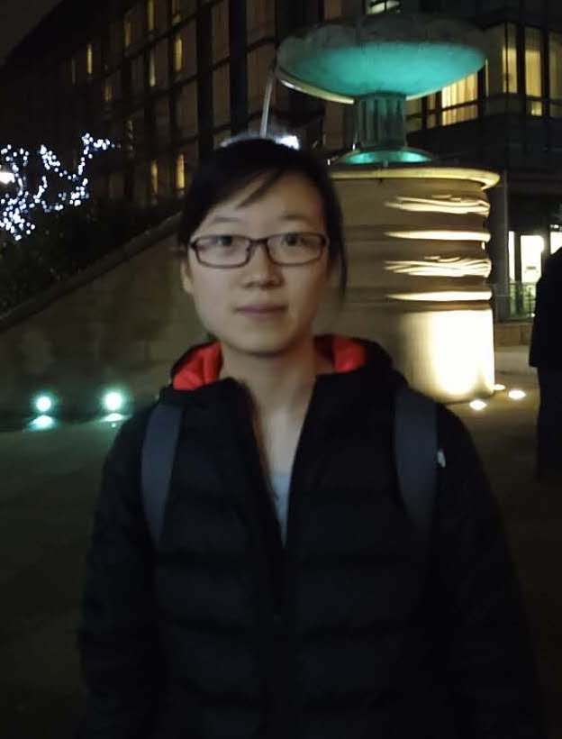

---
# Feel free to add content and custom Front Matter to this file.
# To modify the layout, see https://jekyllrb.com/docs/themes/#overriding-theme-defaults
# Welcome to my personal website!
layout: home
---

# 
 <b>Ning Zhang</b> 

<!-- ### 
Welcom to my personal webpage!
 -->
## **About Me**
I am a research based master student in the department of ECE at the University of British Columbia and my advisor is Lele Wang. I am very fortunate to work with [Lele Wang](https://ece.ubc.ca/lele-wang/) and [Weina Wang](http://www.cs.cmu.edu/~weinaw/) on my thesis project about graph alignment. Prior to that, I obtained my Bachelor of Science in Physics from school of Poling (an academic talent program) at Nankai University in 2019. I was fortunate to have [Xin Chen](http://www.cs.nott.ac.uk/~pszxc/) to advise me on my undergraduate thesis.\
[[Curriculum Vitae]](assets/NingZhangCV.pdf)
 
**Contact**: ningz[at]ece[dot]ubc[dot]ca
 
 
 
## **Research**
My current research interest is mainly about graph theory, probability theory and algorithms. More specifically, I'm studying graph alignment problems. For such a problem, I mainly focus on investigating the information-theoretical limits and designing efficient algorithms, which will succeed with high probability for graphs generated from some particular random graph models.

Beyond what I am working on, I am interested in spectral methods and statistical learning theory. I also know fundamental physics and some basics of machine learning. I am excited to see the transformation of ideas and methods among very different research fields, and I am very motivated to prove things built on some interesting intuitions/images.
 
 

## **Publications and preprints**
- **Attributed Graph Alignment.**\
Ning Zhang, Weina Wang, and Lele Wang.\
IEEE International Symposium on Information Theory (ISIT 2021).\
[[arXiv]](https://arxiv.org/pdf/2102.00665.pdf)
[[Slides]](assets/publication/ISIT2021.pdf)
[[NASIT-Poster]](assets/publication/NASIT2021.pdf)
[[Video]](assets/publication/ISIT2021.mp4)\
 *Our poster won the best poster prize in NASIT 2021.*

- **A spatially constrained deep convolutional neural network for nerve fiber segmentation in corneal confocal microscopic images using inaccurate annotations.**\
Ning Zhang, Susan Francis, Rayaz A. Malik and Xin Chen.\
IEEE International Symposium on Biomedical Imaging (ISBI 2020).\
[[ISBI]](https://ieeexplore.ieee.org/stamp/stamp.jsp?arnumber=9098662)
[[Slides]](assets/publication/ISBI2020.pdf)
[[Code]](https://github.com/XinChenNottingham/SpatiallyConstrainedDCNN)
[[Video]](assets/publication/ISBI2020.mp4)
 
 

## **Teaching**
- Fall 2021 TA for ELEC321/STAT321 Stochastic Signals and Systems
- Spring 2021 Tutorial for ELEC321/STAT321 Stochastic Signals and Systems
- Fall 2020 TA for ELEC321/STAT321 Stochastic Signals and Systems
- Spring 2020 Lab TA for ELEC291 Electrical Engineering Design Studio I
