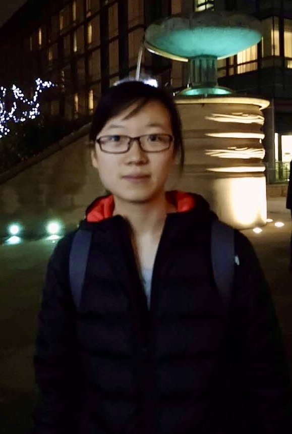

---
# Feel free to add content and custom Front Matter to this file.
# To modify the layout, see https://jekyllrb.com/docs/themes/#overriding-theme-defaults
# Welcome to my website!
layout: home
---

# 
 <b>Ning Zhang</b> 

<!-- ### 
Welcom to my personal webpage!
 -->
## **About Me**
I am a DPhil in the statistics department at the University of Oxford (Computational Discovery CDT), under the supervision of Mihai Cucuringu and Xiaowen Dong. Prior to that, I received my MASc in Electrical and Computer Engineering from the University of British Columbia in 2022, and BSc in Physics from Nankai University in 2019.
[[Curriculum Vitae]](assets/NingZhang_CV.pdf)\
**Contact**: ning.zhang[at]stats[dot]ox[dot]ac[dot]uk
 
 
## **Research**
My research interest lies in the intersection of statistics and computation. Currently, I am focusing on better understanding computational tasks on graphs using tools such as statistics, spectral method, optimization, etc. My research involves proposing data-driven algorithms together with mathematical proofs, and at the same time, I seek to understand the nature of the problems/algorithms through the lens of those proofs. I am excited to see the transformation of ideas across different research fields.
 
 

## **Publications and preprints**
- **[On the Feasible Region of Efficient Algorithms for
Attributed Graph Alignment](https://arxiv.org/pdf/2201.10106.pdf)**\
Ziao Wang, Ning Zhang, Weina Wang, and Lele Wang.\
IEEE Transactions on Information Theory.

- **[Attributed Graph Alignment](https://arxiv.org/pdf/2102.00665.pdf)**\
Ning Zhang, Weina Wang, and Lele Wang.\
IEEE International Symposium on Information Theory (ISIT 2021).
<!-- [[arXiv]] -->
<!--  *Our poster won the best poster prize in NASIT 2021.* -->

- **[Investigating the depolarization property of skin tissue by degree of polarization uniformity contrast using polarization-sensitive optical coherence tomography](https://opg.optica.org/boe/fulltext.cfm?uri=boe-12-8-5073&id=453470)**\
Xin Zhou, Sina Maloufi, Daniel C. Louie, Ning Zhang, Qihao Liu, Tim K. Lee, and Shuo Tang.\
Biomedical Optics Express (2021) 
<!-- [[BOE]](https://opg.optica.org/boe/fulltext.cfm?uri=boe-12-8-5073&id=453470) -->

- **[A spatially constrained deep convolutional neural network for nerve fiber segmentation in corneal confocal microscopic images using inaccurate annotations](https://ieeexplore.ieee.org/stamp/stamp.jsp?arnumber=9098662)**\
Ning Zhang, Susan Francis, Rayaz A. Malik and Xin Chen.\
IEEE International Symposium on Biomedical Imaging (ISBI 2020).
[[Code]](https://github.com/XinChenNottingham/SpatiallyConstrainedDCNN)
<!-- [[Video]](assets/publication/ISBI2020.mp4) -->
 
 

## **Talks**
- Nov. 2023: Maximum Likelihood Estimation on Stochastic Blockmodels for Directed Graph Clustering at the 12th International Conference on Complex Networks and their Applications
- Aug. 2021: [Poster](assets/publication/NASIT2021.pdf) presentation at North American School of Information Theory (<i>best poster prize!</i>);
- Aug. 2021: [Empirical vector quantization](assets/SLT-chap10.pdf) at UBC statistical learning theory reading group; 
- Jul. 2021: [Empirical risk minimization and Rademacher averages](assets/SLT-chap6.pdf) at UBC statistical learning theory reading group; 
- Jun. 2021: [Attributed graph alignment](assets/publication/ISIT2021.pdf) at ISIT [(Video)](assets/publication/ISIT2021.mp4);
- Jun. 2020: [Semi-definite programming for SBM clustering and Grothendieck inequality](assets/2020MDS.pdf) at UBC stat-graph reading group; 
- Apr. 2020: [Spatially constrained DCNN for image segmentation](assets/publication/ISBI2020.pdf) at ISBI;

## **Teaching**
- Michaelmas term 2023, Probability and Statistics for Network Analysis
- Spring 2022, STAT321 Stochastic Signals and Systems
- Fall 2021, STAT321 Stochastic Signals and Systems
- Spring 2021, STAT321 Stochastic Signals and Systems
- Fall 2020, STAT321 Stochastic Signals and Systems
- Spring 2020, ELEC291 Electrical Engineering Design Studio I
 
 

## **Other resources**
[//]: <> (Things I enjoy reading regularly:)
**Stack of books that I am reading/have read:**
- [The Nature of Statistical Learning Theory](https://link.springer.com/book/10.1007/978-1-4757-3264-1)
- [Graph Representation Learning](https://cs.mcgill.ca/~wlh/grl_book/)
- [More Is Different: Broken symmetry and the nature of the hierarchical structure of science.](https://www.science.org/doi/10.1126/science.177.4047.393) By P W Anderson
